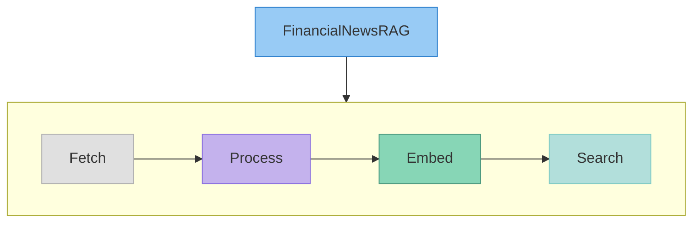
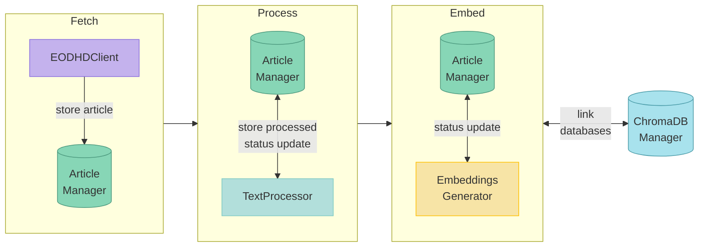
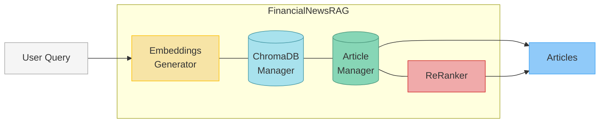

# Financial News RAG

> **Automate. Analyze. Act.**

A modern, AI-powered backend for financial news retrieval, search, and analysis—built for teams who need actionable insights, not information overload.



---

## 🚀 What is Financial News RAG?

**Financial News RAG** (Retrieval Augmented Generation) is a Python library and backend system that streamlines the process of fetching, processing, embedding, and searching financial news articles. It leverages advanced NLP and LLMs to help you:

- **Automate** news collection from sources like EODHD
- **Transform** raw news into structured, searchable data
- **Search** semantically for relevant articles using vector embeddings
- **Re-rank** results with LLMs for maximum relevance

**Stop sifting. Start finding.**

---

## 🔑 Key Features

- **End-to-end pipeline:** From news ingestion to semantic search
- **LLM-powered re-ranking:** Uses Gemini for smarter results
- **Configurable & extensible:** API keys, models, and storage are all customizable
- **Production-ready:** Built for integration into financial dashboards, research tools, and analytics platforms

---

## 📦 Installation

See the [Installation Guide](docs/installation.md) for full instructions, including API key setup.

```bash
pip install financial-news-rag
```

---

## ⚡ Quick Start

```python
from financial_news_rag import FinancialNewsRAG

# Initialize with your config (see docs/configuration.md)
rag = FinancialNewsRAG()

# Article Storage Pipeline
rag.fetch_and_store_articles(
        tag="MERGERS AND ACQUISITIONS", 
        from_date="2025-05-26", 
        to_date="2025-04-26", 
        limit=1000
    )
rag.process_articles_by_status(status='PENDING')
rag.embed_processed_articles()

# Article Search
query = "Which billion-dollar M&A deals were announced in the tech sector in the last 30 days, and what were the valuation multiples?"
results = orchestrator.search_articles(
        query=query, 
        n_results=50,
        rerank=True
    )
```

See the [Usage Guide](./docs/usage_guide.md) for a full walkthrough and more examples.

Or check out the [Notebook Example](./examples/financial_news_rag_example.ipynb) for an interactive tutorial. 

---

## 📚 Documentation

- [Project Overview & Architecture](./docs/index.md)
- [Installation Guide](./docs/installation.md)
- [Usage Guide](./docs/usage_guide.md)
- [Configuration Reference](./docs/configuration.md)
- [API Reference](./docs/api_reference/index.md)
- [Testing Guide](./docs/testing.md)
- [Development Guide](./docs/development.md)

---

## Method Flowcharts

### Article Storage Pipeline

This flowchart illustrates the article storage pipeline.



### Article Search

This flowchart shows the steps involved in searching for articles based on a user query.



---

**Financial News RAG: Built for speed, scale, and smarter financial decisions.**
