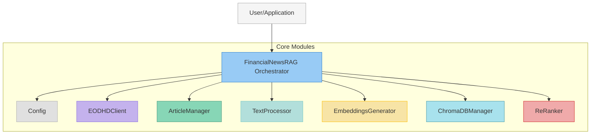
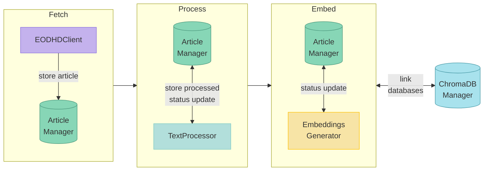
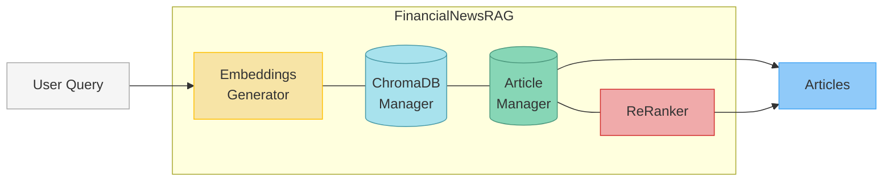

# Financial News RAG Project

## 1. Overview

Welcome to the Financial News RAG (Retrieval Augmented Generation) project documentation. This system is designed to provide a comprehensive solution for fetching, processing, storing, embedding, and searching financial news articles. By leveraging advanced NLP models and vector database technologies, it allows users to efficiently find relevant financial information and insights from a large corpus of news data.

The core problem this project addresses is the challenge of information overload in the financial domain. Analysts, investors, and researchers often need to sift through vast amounts of news to find specific information relevant to their needs. This project aims to streamline that process by:
- **Automating** the collection and processing of financial news from sources like EODHD.
- **Transforming** raw news content into a searchable format using text processing and embedding techniques.
- **Providing** a powerful search interface that uses semantic understanding to retrieve the most relevant articles for a given query.
- **Enabling** re-ranking of search results for enhanced accuracy using Large Language Models (LLMs) like Google's Gemini.

## 2. Purpose

The primary purpose of the Financial News RAG project is to empower users with an efficient and intelligent tool for financial news analysis. It serves as a backend system that can be integrated into various financial applications, research workflows, or analytical dashboards.

Key goals include:
- **Accessibility:** Making financial news data easily accessible and queryable.
- **Relevance:** Ensuring that search results are highly relevant to user queries.
- **Scalability:** Designing the system to handle a growing volume of news articles.
- **Customizability:** Allowing users to configure various aspects of the system, from data sources to embedding models.

## 3. Architecture

The Financial News RAG system is built around a central orchestrator, `FinancialNewsRAG`, which coordinates the activities of several specialized components.

### Core Components:

*   **`FinancialNewsRAG` Orchestrator (`orchestrator.py`):**
    *   The main user interface and entry point for interacting with the system.
    *   Manages the overall workflow, from fetching articles to returning search results.
    *   Integrates all other components.

*   **EODHD Client (`eodhd.py`):**
    *   Responsible for fetching financial news articles from the EODHD API.
    *   Handles API authentication, request formatting, and error management.

*   **Article Manager (`article_manager.py`):**
    *   Manages the storage and retrieval of article metadata and raw/processed content in a SQLite database.
    *   Tracks the processing and embedding status of each article.

*   **Text Processor (`text_processor.py`):**
    *   Cleans HTML from raw article content.
    *   Extracts the main textual content and validates it.
    *   Splits processed text into manageable chunks suitable for embedding.

*   **Embeddings Generator (`embeddings.py`):**
    *   Generates vector embeddings for text chunks using models like Google's Gemini.
    *   Ensures the quality and validity of generated embeddings.

*   **ChromaDB Manager (`chroma_manager.py`):**
    *   Manages the storage and querying of vector embeddings in a ChromaDB collection.
    *   Provides efficient similarity search capabilities.

*   **ReRanker (`reranker.py`):**
    *   Optionally re-ranks search results using a Gemini LLM to improve relevance based on the original query and retrieved article content.

*   **Configuration (`config.py`):**
    *   A centralized class for managing all system configurations, including API keys, database paths, model names, and processing parameters. Settings can be loaded from environment variables or overridden programmatically.

### High-Level Architectural Diagrams

#### A. Module Overview

This diagram shows the main `FinancialNewsRAG` orchestrator and its direct dependencies on the core internal modules.

#### B. Article Storage Flowchart

This flow illustrates the article storage pipeline.

#### C. Article Search Flowchart

This flow shows the steps involved in searching for articles based on a user query.

## 4. Getting Started

To get started with the Financial News RAG system, please refer to the following documents:

*   **[Installation Guide (`installation.md`)](installation.md):** Instructions on how to install the package and set up necessary API keys.
*   **[Usage Guide (`usage_guide.md`)](usage_guide.md):** A comprehensive guide on how to use the `FinancialNewsRAG` orchestrator with code examples.
*   **[Configuration (`configuration.md`)](configuration.md):** Detailed information on all configurable parameters.

## 5. For Developers

If you plan to contribute to the project or understand its internals, the following resources will be helpful:

*   **[Development Guide (`development.md`)](development.md):** Information on setting up the development environment, coding standards, and contribution guidelines.
*   **[API Reference (`api_reference/`)](api_reference/):** Detailed API documentation for all modules and classes.
*   **[Testing Guide (`testing.md`)](testing.md):** Instructions on how to run tests and understand the testing framework.

---

This `index.md` serves as the main entry point to the project's documentation. We encourage you to explore the linked documents to gain a deeper understanding of the Financial News RAG system.
